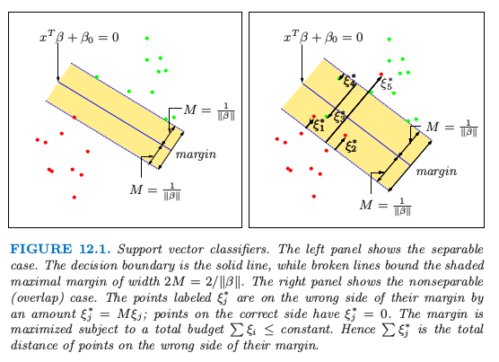
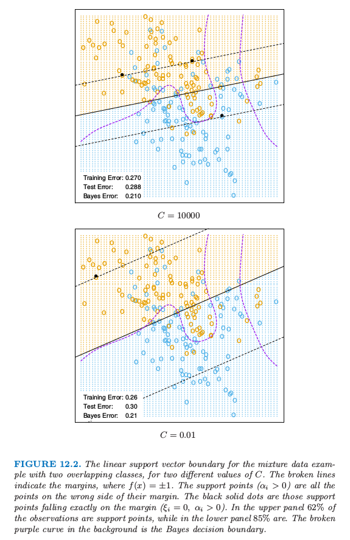

# 12.2 支持向量分类器

| 原文   | [The Elements of Statistical Learning](https://web.stanford.edu/~hastie/ElemStatLearn/printings/ESLII_print12.pdf) |
| ---- | ---------------------------------------- |
| 翻译   | szcf-weiya                               |
| 时间   | 2016-12-19:2016-12-20                   |
|更新|2020-01-03 11:29:06 |
|状态|Done|

!!! note "更新笔记"
    @2017.10.15 关于SVM的具体应用，我写了一篇博客展示了使用R来实现SVM分类，以及通过ROC、AUC来评估分类的好坏．博客链接为[Illustrations of Support Vector Machines](https://stats.hohoweiya.xyz//2017/05/18/Support-Vector-Classifier/)

    @2018.02.12 将博客[Illustrations of Support Vector Machines](https://stats.hohoweiya.xyz//2017/05/18/Support-Vector-Classifier/)整理到[SVM处理线性和非线性类别边界](https://esl.hohoweiya.xyz/notes/SVM/e1071/index.html)．

[第 4 章](../04-Linear-Methods-for-Classification/4.1-Introduction/index.html)中我们讨论了在两个可分类别之间构造一个最优的分离超平面．我们先复习一下，然后推广到不可分的情形下（类别可能不会被线性边界分离）．

我们的训练数据包含 $N$ 对数据点 $(x_1,y_1),(x_2,y_2),\ldots,(x_N,y_N)$，其中 $x_i\in \IR^p,y_i\in \\{-1,1\\}$．定义超平面

$$
\{x:f(x)=x^T\beta+\beta_0=0\}\tag{12.1}\label{12.1}
$$

其中 $\beta$ 是单位向量 $\Vert \beta\Vert=1$．由 $f(x)$ 导出的分类准则为

$$
G(x)=\sign[x^T\beta+\beta_0]\tag{12.2}
$$

超平面的结构在 [4.5 节](../04-Linear-Methods-for-Classification/4.5-Separating-Hyperplanes/index.html)有讨论，我们证明了 \eqref{12.1} 中的 $f(x)$ 给出了点 $x$ 到超平面 $f(x)=x^T\beta+\beta_0=0$ 的符号距离．因为类别是可分的，则我们可以找到一个函数$f(x)=x^T\beta+\beta_0$，满足$y_if(x_i)>0,\forall i$．因此我们可以找到超平面在类别 1 和 -1 的训练点之间创造最大的 margin（图12.1）．

> 图12.1. 支持向量分类器．左图显示了可分情形．判别边界是实线，而虚线确定了 margin（阴影部分）的最大宽度为 $2M=2/\Vert\beta\Vert$．右图中显示了不可分（重叠）情形．标记为 $\xi_j^\*$ 的点是在 margin 错误的一侧，且 $\xi_j^\*=M\xi_j$；在正确一侧的点满足 $\xi_j^\*=0$. 在总代价 $\sum\xi_i\le constant$ 的约束下最大化 margin. 因此，$\sum\xi_j^\*$ 是在 margin 错误的一侧的点的距离总和．

优化问题是

$$
\begin{array}{ll}
\underset{\beta,\beta_0,\Vert \beta\Vert=1}{\max}\; M\\
s.t.\;y_i(x_i^T\beta+\beta_0)\ge M,\;i=1,\ldots,N,
\end{array}
\tag{12.3}\label{12.3}
$$

图中的条纹宽度为$M$，它是分离超平面到其中一边的距离，因此总共宽度为 $2M$．这称为 **margin**．

我们已经证明了这个问题可以更方便地写成

$$
\begin{array}{ll}
&\underset{\beta,\beta_0}{\min}\;\Vert\beta\Vert\\
s.t.&\; y_i(x_i^T\beta+\beta_0)\ge 1,\; i=1,\ldots,N
\end{array}
\tag{12.4}\label{12.4}
$$

我们删掉了对于 $\beta$ 模长的约束．注意到 $M=1/\Vert\beta\Vert$．表达式 \eqref{12.4} 是稀疏数据的支持向量准则的通常形式．这是一个凸优化问题（二次准则，线性不等约束），解在 [4.5.2 节](../04-Linear-Methods-for-Classification/4.5-Separating-Hyperplanes/index.html#452)已经讨论了．

假设在特征空间中类别有重叠．一种处理重叠的方式仍然是最大化 $M$，但是只允许一些点在边缘空白的错误一侧．定义松弛变量 $\xi=(\xi_1,\xi_2,\ldots,\xi_N)$．有两种自然的方式去修改 \eqref{12.3} 中的约束：

$$
y_i(x_i^T\beta+\beta_0)\ge M-\xi_i\tag{12.5}
$$

或者

$$
y_i(x_i^T\beta+\beta_0) \ge M(1-\xi_i)\tag{12.6}\label{12.6}
$$

$\forall i,\xi_i\ge 0,\sum_{i=1}^N\xi_i\le constant$．这两个选择会导出不同的解．第一个选择似乎更加自然，因为它衡量了到 margin 的实际距离；第二个选择衡量了相对距离，它会随着 margin 的宽度 $M$ 的改变而改变．然而，第一个选择是一个非凸的优化问题，而第二个是凸的；因此 \eqref{12.6} 导出标准的支持向量分类器，我们从这里开始使用它．

下面介绍该想法的形成过程．约束条件 $y_i(x_i^T\beta+\beta_0)\ge M(1-\xi_i)$ 中的 $\xi_i$ 与通过 $f(x_i)=x_i^T\beta+\beta_0$ 预测得到的错误分类总数成比例．因此通过约束 $\sum\xi_i$，我们约束了错误预测总数的比例．当 $\xi_i>1$ 则为错误分类，所以在 $K$ 的水平下约束 $\sum\xi_i$ 表示为限制训练集中错分类个数小于 $K$.

类似 [4.5.2 节](../04-Linear-Methods-for-Classification/4.5-Separating-Hyperplanes/index.html)中的 \eqref{4.48}，我们可以去掉在 $\beta$ 上的约束，定义 $M=1/\Vert\beta\Vert$，然后将 \eqref{12.4} 写成下面的等价形式

!!! note "weiya 注：Recall"
    $$
    \begin{align*}
    \underset{\beta,\beta_0}{\min}&\frac{1}{2}\Vert\beta\Vert^2\\
    \st & y_i(x_i^T\beta+\beta_0)\ge 1 \; i=1,\ldots,N 
    \end{align*}
    \tag{4.48}\label{4.48}
    $$

$$
\min\;\Vert\beta\Vert\qquad s.t.\;\left\{\begin{array}{ll}y_i(x_i^T\beta+\beta_0)\ge 1-\xi_i\;\forall i,\\
\xi_i\ge 0,\sum\xi_i\le constant.\end{array}\right.\tag{12.7}\label{12.7}
$$

这是非分离情形下支持向量分类器定义的通常方式．然而我们会对约束 $y_i(x_i^T\beta+\beta_0)\ge 1-\xi_i$ 中的固定常数 1 感到困惑，更喜欢使用 \eqref{12.6} 式．图12.1的右图说明了重叠的情形．

从准则 \eqref{12.7} 可以看出，在类别里面的点不会对边界的形成有太大的影响．这似乎是个很吸引人的性质，这与线性判别边界（[4.3 节](../04-Linear-Methods-for-Classification/4.3-Linear-Discriminant-Analysis/index.html)）不同．LDA 中，判别边界是由类别的分布的协方差和重心来决定．我们将在 [12.3.3 节](12.3-Support-Vector-Machines-and-Kernels/index.html) 看到逻辑斯蒂回归在这点上很像．

## 计算支持向量分类器

问题 \eqref{12.7} 是带有线性不等值约束的二次问题，因此这是一个凸优化问题．我们描述一种采用 Lagrange 乘子的二次规划解法．将式 \eqref{12.7} 重新表达成下面的等价形式是很方便的

$$
\begin{array}{ll}
\underset{\beta,\beta_0}{\min}&\;\frac{1}{2}\Vert\beta\Vert^2+C\sum\limits_{i=1}^N\xi_i\\
s.t.& \xi_i\ge 0\;,y_i(x_i^T\beta+\beta_0)\ge 1-\xi_i,\forall i
\end{array}
\tag{12.8}\label{12.8}
$$

其中“代价”参数 $C$ 替换 \eqref{12.7} 中的常数；可分情况下对应 $C=\infty$. 

Lagrange 函数（原问题）为

$$
L_P=\frac{1}{2}\Vert\beta\Vert^2+C\sum\limits_{i=1}^N\xi_i-\sum\limits_{i=1}^N\alpha_i[y_i(x_i^T\beta+\beta_0)-(1-\xi_i)]-\sum\limits_{i=1}^{N}\mu_i\xi_i\tag{12.9}\label{12.9}
$$

我们需要求关于 $\beta,\beta_0$ 和 $\xi_i$ 的最小值．令对应的微分为 0，我们有

$$
\begin{align}
\beta&=\sum\limits_{i=1}^N\alpha_iy_ix_i& \tag{12.10}\label{12.10}\\
0&= \sum\limits_{i=1}^N\alpha_iy_i& \tag{12.11}\\
\alpha_i&=C-\mu_i,\;\forall i,& \tag{12.12}\label{12.12}
\end{align}
$$

同样有正值约束 $\alpha_i,\mu_i,\xi_i\ge 0\;\forall i$．把 \eqref{12.10}-\eqref{12.12} 代入 \eqref{12.9}，我们得到 Lagrangian(Wolfe) 对偶目标函数

$$
L_D = \sum\limits_{i=1}^N\alpha_i-\frac{1}{2}\sum\limits_{i=1}^N\sum\limits_{i'=1}^N\alpha_i\alpha_{i'}y_iy_{i'}x_i^Tx_{i'}\tag{12.13}\label{12.13}
$$

!!! note "weiya注：对偶问题"
    对于无等值约束的优化问题

    $$
    \underset{x\in\IR^n}{\min}f(x)\; \st c_i(x)\ge 0,\; i=1,2,\ldots,m
    $$

    记
    $$
    c(x)\def(c_1(x), c_2(x),\ldots, c_m(x))^T
    $$
    则原问题写为
    $$
    \underset{x\in\IR^n}{\min}f(x)\; \st c(x)\ge 0
    $$
    Lagrangian函数为
    $$
    {\cal L}(x,\lambda)=f(x)-\lambda^Tc(x)
    $$
    定义对偶目标函数$q:\IR^n\rightarrow \IR$：
    $$
    q(\lambda)\def\underset{x}{\inf}\cal L(x,\lambda)
    $$
    其定义域为
    $$
    \cal D\def\{\lambda\mid q(\lambda)>-\infty\}
    $$
    **若$f$和$-c_i$均为凸函数**，则$\cal L(\cdot, \lambda)$也为凸函数，则可以很容易计算$q(\lambda)$．

    参考资料: [Wright S, Nocedal J. Numerical optimization (Second Edition). Springer Science.](../references/opbook2.pdf)

    

它给出了目标函数 \eqref{12.8} 对于任意可行解的一个下界．我们在满足 $0\le \alpha_i\le C$ 和 $\sum_{i=1}^N\alpha_iy_i=0$ 的条件下最大化$L_D$．再加上 \eqref{12.10}-\eqref{12.12} 条件，Karush-Kuhn-Tucker 条件包含下列约束：对于 $i=1,\ldots,N$，
$$
\begin{align}
\alpha_i[y_i(x_i^T\beta+\beta_0)-(1-\xi_i)]&=0& \tag{12.14}\label{12.14}\\
\mu_i\xi_i&=0& \tag{12.15}\label{12.15}\\
y_i(x_i^T\beta+\beta_0)-(1-\xi_i)&\ge 0& \tag{12.16}\label{12.16}
\end{align}
$$

!!! note "weiya 注：KKT 条件"
    对于带约束的优化问题
    
    一阶必要条件为
    
    图片来源：[Wright S, Nocedal J. Numerical optimization (Second Edition). Springer Science.](../references/opbook2.pdf)

结合 \eqref{12.10}-\eqref{12.16} 我们得到原问题和对偶问题的唯一解

从 \eqref{12.10} 我们看到 $\beta$ 的解有如下形式

$$
\hat\beta=\sum\limits_{i=1}^N\hat\alpha_iy_ix_i\tag{12.17}
$$

非负系数 $\hat\alpha_i$ 只针对约束 \eqref{12.16} 等号成立的观测（由于 \eqref{12.14}）．因为 $\hat\beta$ 用这些观测单独表示，所以把它们称之为 **支持向量**．在这些支持点中，有些会在margin的边缘处($\hat\xi_i=0$)，因此根据式(12.15)，式(12.12)可以用$0 < \hat\alpha_i < C$来表示；剩余部分($\hat \xi_i > 0$)有 $\hat\alpha_i=C$（由 \eqref{12.15} 式得到）．从 \eqref{12.14} 我们可以看到每个边缘点 ($0 < \hat\alpha_i,\;\hat \xi_i = 0$) 都可以用来求解 $\beta_0$，一般地，为了数值稳定性，我们取所有解的均值．

最大化对偶问题 \eqref{12.13} 是比原问题 \eqref{12.9} 更简单的凸优化问题，而且可以用标准的方法进行求解（举个例子，Murray et al., 1981[^1]）

给定解 $\hat\beta_0$ 和 $\beta$，判别函数可以写成
$$
\begin{array}{ll}
\hat G(x)&=\sign[\hat f(x)]\\
&=\sign[x^T\hat\beta+\hat\beta_0]\tag{12.18}
\end{array}
$$
这个过程的调整参数是代价参数 $C$．

## 混合例子（继续）

> 图12.2 对于两个不同$C$值，有两个重叠类别的混合数据例子的线性支持向量边界．虚线表示margin，其中$f(x)=\pm 1$．支持点（$\alpha_i>0$）是在它们margin的错误一侧的点．黑色实心点是恰巧落在margin边界上（$\xi_i=0,\alpha_i>0$）的点．在上面板中，$62\%$的观测点都是支持点，而下面的图$85\%$的点都是．紫色虚线是贝叶斯判别边界．

图12.2显示了图 2.5 混合例子对于两个不同代价参数 $C$ 的支持向量边界，这里有两个重叠的类别．这些分类器的表现很相似．在边界的错误一侧是支持向量．另外，在判别边界附近正确一侧的点也是支持向量．$C=0.01$ 时的 margin 比 $C=10,000$ 时的大．因此大的 $C$ 值更加注意（正确分类）靠近判别边界的点，而较小的 $C$ 涉及离判别边界更远的点．

!!! note "weiya 注"
    $C$ 越大，margin 越窄；$C$ 越小，margin 越宽．这对应 R 的`e1071`包`svm()`函数中的`cost`参数．

任意一种方式，错分类的点都被赋予了权重，不管离多远．由于判别边界的刚性(rigidity)，在这个例子中这个过程对 $C$ 的取值不敏感．

!!! question
    怎么理解判别边界的刚性(the rigidity of a linear boundary)

最优的 $C$ 可以通过交叉验证来确定，如第 7 章中讨论的那样．有趣的是，舍一交叉验证误差可以通过数据中支持向量的点的比例来控制．原因是当舍去的不是支持向量的时候不会改变解．因此这些观测点在原始边界中正确分类的点在交叉验证中也能正确分类．然而，这个界趋向于偏高，而且一般不适用于选择 $C$(在我们的例子中分别是 62% 和 85%)．

[^1]: Murray, W., Gill, P. and Wright, M. (1981). Practical Optimization, Academic Press.
